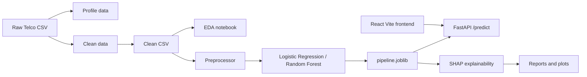

# Telco Customer Churn Prediction

## 1. Project Summary

This project predicts whether a telecom customer is likely to churn. It contains a complete machine-learning workflow:

1. Load and profile the raw Telco customer data.
2. Clean inconsistent values and prepare a modeling dataset.
3. Explore churn patterns through EDA.
4. Build a reusable preprocessing pipeline.
5. Train and compare baseline classification models.
6. Save the selected model as a reusable artifact.
7. Serve predictions through a FastAPI backend.
8. Call the backend from a React + Vite frontend.
9. Generate SHAP explainability plots for model interpretation.

The current prediction target is `Churn`:

- `1` means the customer is predicted to churn.
- `0` means the customer is predicted not to churn.

## 2. Architecture



The frontend runs separately on port `5173` during development. The FastAPI backend runs on port `8000` and allows requests from the Vite development origin through CORS.

## 3. Dataset Flow

### Raw data

The raw dataset is located at:

`src/data/telco_churn.csv`

It contains telecom customer information such as:

- Demographic details: gender, senior-citizen status, partner, dependents
- Account details: tenure, contract, paperless billing, payment method
- Service details: phone, internet, security, backup, protection, support, streaming
- Financial details: monthly charges and total charges
- Target: churn status

### Data profiling

`src/data/profile_data.py` profiles the input dataset and reports:

- Shape
- Data types
- Missing values and missing percentages
- Duplicate rows
- Categorical cardinality
- Numeric descriptive statistics
- Target counts and class balance

The generated files are:

- `reports/dataset_profile.json`
- `reports/dataset_profile.txt`

### Data cleaning

`src/data/clean_data.py` creates the modeling dataset at:

`data/clean_telco.csv`

The cleaning steps are:

- Convert `TotalCharges` from text to numeric.
- Set missing `TotalCharges` to `0` when `tenure == 0`.
- Fill any remaining missing `TotalCharges` with its median.
- Convert `Churn` from `Yes`/`No` to `1`/`0`.
- Preserve the cleaned data as a CSV file.

## 4. Five EDA Insights

The EDA work is in `notebooks/01_eda.ipynb`. The main findings are:

1. **Churn is an imbalanced target.**
   The raw dataset contains 7,043 customers. Approximately 73.46% did not churn and 26.54% churned. This is why the training workflow uses stratification and class balancing rather than relying only on accuracy.

2. **Short-tenure customers are more vulnerable.**
   Churn is generally higher among customers with fewer months of tenure. New customers have had less time to build loyalty and are more sensitive to onboarding or early service problems.

3. **Month-to-month contracts have the highest churn risk.**
   Customers without a long-term contract are more able to leave quickly. One-year and two-year contracts generally show lower churn rates than month-to-month contracts.

4. **Higher monthly charges are associated with greater churn pressure.**
   Customers paying more each month can be more sensitive to price or perceived value. Monthly charges are therefore included as an important numeric model feature.

5. **Service and billing choices reveal retention signals.**
   Payment method, paperless billing, internet service, and add-on services such as security or technical support provide useful behavioral signals. These categorical fields are one-hot encoded so the model can use them.

EDA charts include churn counts, tenure comparisons, monthly-charge distributions, contract-level churn rates, tenure bins, and a numeric correlation heatmap.

## 5. Preprocessing

`src/processing/preprocessor.py` creates the transformation used by training and serving.

### Numeric features

Numeric columns use:

1. `SimpleImputer(strategy="median")`
2. `StandardScaler()`

### Categorical features

Categorical columns use:

1. `SimpleImputer(strategy="constant", fill_value="missing")`
2. `OneHotEncoder(handle_unknown="ignore")`

`OneHotEncoder` is created with compatibility handling for different scikit-learn versions (`sparse` versus `sparse_output`).

The preprocessor is placed inside a scikit-learn `Pipeline`, ensuring that transformations are applied consistently before classification.

## 6. Model Training

`src/models/train_telco.py` trains and compares:

- Logistic Regression
- Random Forest

The workflow uses:

- A stratified 5-fold cross-validation split
- ROC-AUC scoring
- Average precision / PR-AUC scoring
- A stratified 80/20 train-test split
- `class_weight="balanced"` for both baseline models

The model is selected by mean cross-validation PR-AUC because churn is the minority class and positive-class ranking is important.

### Current cross-validation results

| Model | Mean ROC-AUC | Mean PR-AUC |
|---|---:|---:|
| Logistic Regression | 0.8450 | 0.6555 |
| Random Forest | 0.8187 | 0.5997 |

Logistic Regression was selected because it achieved the better mean PR-AUC.

### Current test results

The saved model metadata in `models/model_info.json` contains:

| Metric | Value |
|---|---:|
| Precision | 0.5043 |
| Recall | 0.7834 |
| F1 | 0.6136 |
| ROC-AUC | 0.8416 |
| PR-AUC | 0.6327 |
| Confusion matrix | `[[747, 288], [81, 293]]` |

The relatively high recall means the model identifies many actual churners, while the precision shows that some customers flagged as at risk will not actually churn.

### Prediction threshold

The model produces a churn probability using `predict_proba`. The API converts that probability to a binary prediction with a threshold of `0.50`:

```python
prediction = int(proba >= 0.5)
```

Therefore:

- Probability below `0.50` gives prediction `0`.
- Probability greater than or equal to `0.50` gives prediction `1`.

The frontend uses separate display labels:

- Below `35%`: Healthy
- `35%` to below `60%`: Monitor
- `60%` and above: Attention

These frontend bands do not change the model's actual binary threshold.

## 7. Saved Model Artifacts

### `models/pipeline.joblib`

This is the serialized scikit-learn pipeline containing:

- Feature preprocessing
- The selected classifier

It is loaded by the FastAPI application.

### `models/model_info.json`

This stores:

- Selected model name
- Evaluation metrics
- Confusion matrix

## 8. Explainability

`src/models/shap_explain.py` explains the saved linear model after preprocessing.

The script:

1. Loads the pipeline and cleaned dataset.
2. Samples up to 200 customers.
3. Applies the fitted preprocessing step.
4. Uses `shap.LinearExplainer` for the logistic regression classifier.
5. Creates a global SHAP summary plot.
6. Selects the feature with the highest mean absolute SHAP value.
7. Creates a dependence plot for that feature.

Current generated outputs include:

- `reports/shap_summary.png`
- `reports/shap_dependence_num__tenure.png`

The current top transformed feature reported by the script is `num__tenure`.

## 9. Backend API

The backend is implemented in `api/main.py` using FastAPI.

### Start the backend

From the project root:

```powershell
.\venv\Scripts\Activate.ps1
python -m uvicorn api.main:app --reload --port 8000
```

### Endpoints

#### `GET /health`

Checks whether the API is running and whether a model is loaded.

Example response:

```json
{
  "status": "ok",
  "model_loaded": true
}
```

#### `GET /model/info`

Returns the selected model name and saved evaluation metrics.

#### `POST /predict`

Accepts either a top-level feature object or a wrapper using `{"features": {...}}`.

Example request:

```json
{
  "features": {
    "gender": "Female",
    "SeniorCitizen": 0,
    "Partner": "No",
    "Dependents": "No",
    "tenure": 12,
    "PhoneService": "Yes",
    "MultipleLines": "No",
    "InternetService": "DSL",
    "OnlineSecurity": "No",
    "OnlineBackup": "Yes",
    "DeviceProtection": "No",
    "TechSupport": "No",
    "StreamingTV": "No",
    "StreamingMovies": "No",
    "Contract": "Month-to-month",
    "PaperlessBilling": "Yes",
    "PaymentMethod": "Electronic check",
    "MonthlyCharges": 70.35,
    "TotalCharges": 845.5
  }
}
```

Example response:

```json
{
  "probability": 0.8055,
  "prediction": 1
}
```

#### `POST /model/reload`

Attempts to reload `models/pipeline.joblib` without restarting the server. This endpoint exists to support retraining and refreshing the model during development.

### Request validation

`api/schemas.py` defines the `CustomerFeatures` Pydantic model. It validates required fields and their basic types before inference. `customerID` is optional and is removed before the row is sent to the model.

### Logging

`api/logging.py` prints a JSON log entry for each prediction containing:

- Timestamp
- Input hash
- Input features
- Probability
- Binary prediction
- Prediction duration

### CORS

The backend permits the local Vite origins:

- `http://localhost:5173`
- `http://127.0.0.1:5173`

## 10. Frontend

The frontend is a React application powered by Vite under `frontend/`.

### Main files

- `frontend/package.json`: dependencies and npm scripts
- `frontend/vite.config.js`: Vite development configuration
- `frontend/index.html`: browser entry document
- `frontend/src/main.jsx`: React entry point
- `frontend/src/App.jsx`: dashboard UI, form state, request handling, and result display
- `frontend/src/api.js`: `fetch` helper for `POST /predict`
- `frontend/src/styles.css`: responsive dashboard design

### Start the frontend

From the project root:

```powershell
cd frontend
npm install
npm run dev
```

Open:

`http://localhost:5173`

The frontend sends requests to `http://localhost:8000` by default. To use another backend URL, create `frontend/.env`:

```text
VITE_API_URL=http://localhost:8000
```

The interface displays:

- Customer profile controls
- Prediction probability
- A visual probability meter
- Healthy, Monitor, or Attention status
- Retention guidance
- Model status information

## 11. Quick End-to-End Run

Run these commands in separate terminals.

### Terminal 1: backend

```powershell
cd C:\Internship\churn-prediction
.\venv\Scripts\Activate.ps1
python -m uvicorn api.main:app --reload --port 8000
```

### Terminal 2: frontend

```powershell
cd C:\Internship\churn-prediction\frontend
npm install
npm run dev
```

### Optional: clean and retrain

```powershell
cd C:\Internship\churn-prediction
.\venv\Scripts\Activate.ps1
python src/data/clean_data.py --in src/data/telco_churn.csv --out data/clean_telco.csv
python src/models/train_telco.py --data data/clean_telco.csv
```

### Optional: test the API from Python

```powershell
python src/api/test_predict.py
```

## 12. Project File Map

```text
churn-prediction/
├── api/
│   ├── main.py              FastAPI app and prediction endpoints
│   ├── schemas.py           Pydantic request schema
│   └── logging.py           JSON prediction logging
├── data/
│   └── clean_telco.csv      Cleaned modeling dataset
├── frontend/
│   ├── package.json         React/Vite dependencies and scripts
│   ├── vite.config.js       Vite configuration
│   └── src/
│       ├── App.jsx          Prediction dashboard
│       ├── api.js           Backend request helper
│       ├── main.jsx         React entry point
│       └── styles.css       Dashboard styling
├── models/
│   ├── pipeline.joblib      Saved preprocessing + classifier pipeline
│   └── model_info.json      Model name and evaluation metrics
├── notebooks/
│   └── 01_eda.ipynb        Exploratory analysis notebook
├── reports/
│   ├── dataset_profile.json Dataset profile data
│   ├── dataset_profile.txt  Human-readable profile
│   ├── shap_summary.png     SHAP global importance plot
│   └── shap_dependence_*.png SHAP feature dependence plot
├── src/
│   ├── data/
│   │   ├── load_data.py     CSV loading helper
│   │   ├── profile_data.py  Dataset profiling
│   │   └── clean_data.py    Dataset cleaning
│   ├── models/
│   │   ├── train_telco.py   Model training and evaluation
│   │   └── shap_explain.py  SHAP explanation generation
│   ├── processing/
│   │   └── preprocessor.py  Numeric and categorical transformations
│   └── api/
│       └── test_predict.py  API smoke-test script
└── PROJECT_DOCUMENTATION.md This document
```

## 13. Known Limitations and Next Improvements

1. **Model persistence is sensitive to scikit-learn versions.** The saved artifact was previously produced under a different scikit-learn version, which can produce `InconsistentVersionWarning` or `SimpleImputer` compatibility errors. Retraining and serving with the same environment is recommended.
2. **The current API fallback rebuilds preprocessing during an error.** This is useful for development recovery, but production should use a single consistently versioned artifact or a fully code-defined serving pipeline.
3. **The frontend currently exposes a focused subset of fields.** The backend schema accepts the complete customer profile, while the dashboard currently collects the highest-signal fields shown in the UI.
4. **The binary threshold is fixed at 0.50.** A future version could tune the threshold using business costs, recall targets, or a precision-recall analysis.
5. **LightGBM and hyperparameter optimization are not yet implemented.** The current comparison is limited to Logistic Regression and Random Forest.
6. **SHAP is currently saved as report images.** It is not yet returned per request by the API or embedded directly into the frontend.
7. **Docker deployment has not yet been added.** The current project is run with a Python virtual environment and a separate npm development server.

## 14. Business Interpretation

The system is intended to help a retention team prioritize customers for outreach. It should not be treated as a guaranteed decision about an individual customer. A high score indicates that the profile resembles customers who churned in the training data; it does not establish why that customer will leave.

A practical workflow is:

1. Submit a customer's current account profile.
2. Read the churn probability and binary prediction.
3. Prioritize high-risk customers for human review.
4. Use account context and service history to choose an appropriate retention action.
5. Monitor outcomes and retrain the model as new churn data becomes available.
